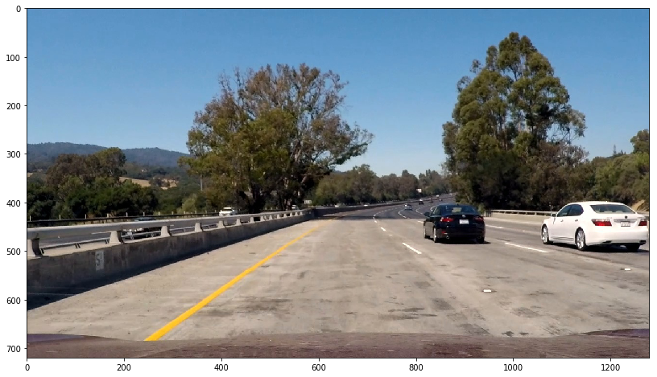
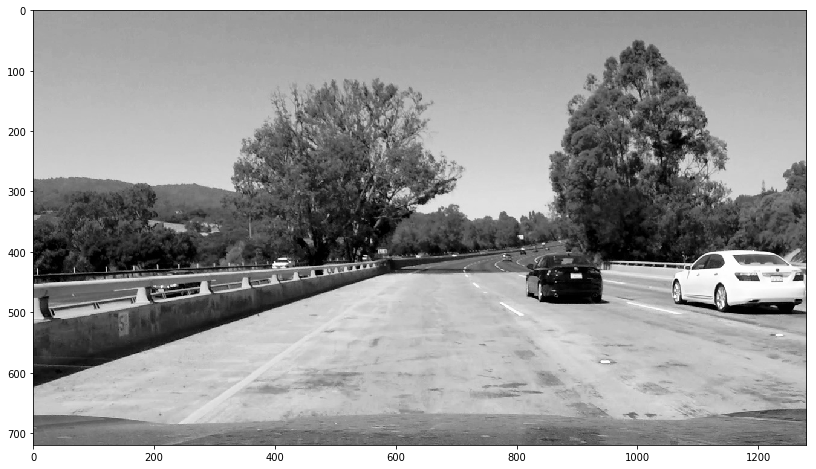
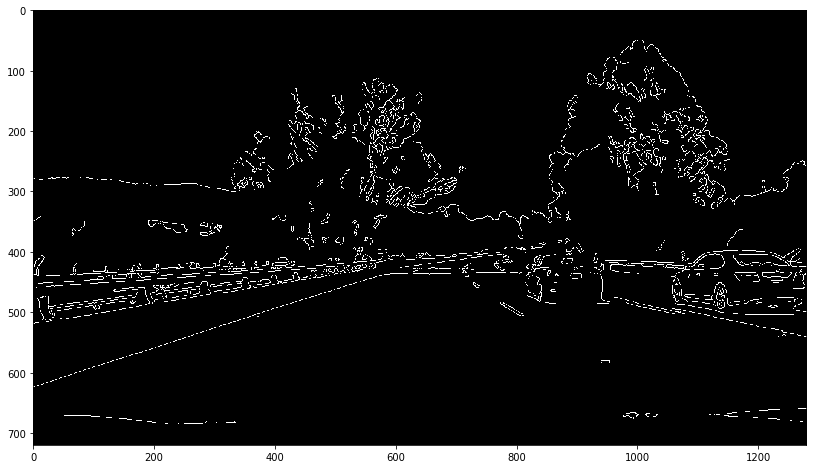
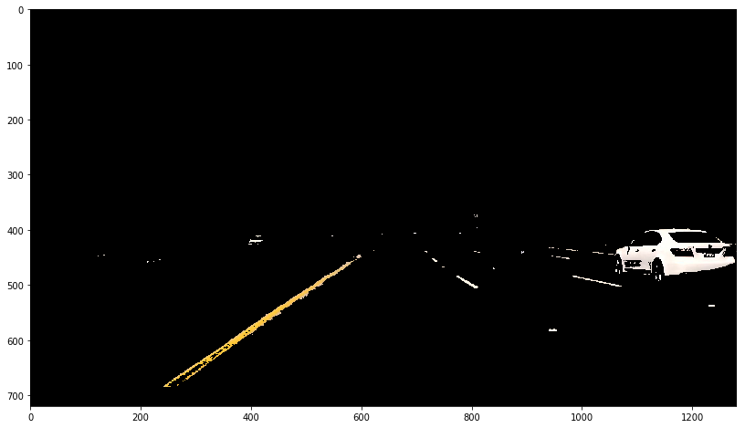
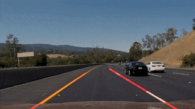

 Road Lane Line Detection
 # **Finding Lane Lines on the Road** 

Overview
---

When we drive, we use our eyes to decide where to go.  The lines on the road that show us where the lanes are act as our constant reference for where to steer the vehicle.  Naturally, one of the first things we would like to do in developing a self-driving car is to automatically detect lane lines using an algorithm.

This project is to detect lane lines in images using Python and OpenCV.  OpenCV means "Open-Source Computer Vision", which is a package that has many useful tools for analyzing images.

Files contained in this repository:
  ./test_images - Original images for testing and output Images with lane lines 
  ./test_videos - Origianl videos for testing
  ./test_videos_output - Videos with lane lines

---

**Lane Line Detection Testing Image Example**
Original Image:

Output Image with Lanes:

---
### Project Summary
---
There are three parts to the reflection:

### 1. Pipeline of Project
* 1. Describe the pipeline
* Step 0 - Get Image and the size of image

* Step 1 - Convert a image to Grayscale of the image

* Step 2 - Apply Gaussian smoothing / blurring to the grayscaled image
* Step 3 - Apply Canny edge detector to find all edges
Canny detector would not detect lines well since it lost valuable color information(yellow/white) when converting the image in grayscale. Another challenge is that the color of the asphalt became lighter at certain points. Moreover, the Canny operator finds more edges than necessary such as horizontal landmark line and vertical tree lines etc.

* Step 4 - Define the region of interest and apply region masking surroundings + color mask
To overcome canny detector problems above, I introduced the color maskWith the color mask I was able to detect the lines

* Step 5 - Apply Hough transformation to find the lines in the region of interest
* Step 6 - Draw the lines on the edge of the image using draw_lines() function. More than one lines are generated from the previous step for left/right lane. Use the slope to detect if a specific line belongs to the left/right lane. Then fit a liear polynomial among all the points and use that line as the left/right lane. It helps to reduce the number of lines in the image.

### 2. Shortcomings
* One shortcoming is on the curve, the line cannot follow fast enough to the speed of slope changes  
* The lane line direction is not always correct when the actual lane is not that clear on the right.
* The right line is a little jumpy in the curve: the function feline is trying to fit a line on a curvy lane. It would be useful to shrink the ROI in this case, however I preferred to keep the same ROI size used to apply consistently.

### 3. Result 
Visually, the left and right lane lines are accurately annotated by solid lines throughout most of the video.

### 3. Possible improvements
* Missing lane - interpolate previous frame's lanes to accomodate missing/blur lanes 
* Light Adaptability - video processing needs some level or exploitation to adapt various light conditions  (very bright sunlight can cause reflction of white lane, very dark light in the night can cause lots of missing lanes) 
* more precise calculation (i.e. instead of linear slope, some sort of elliptical line) algorithm is needed to detect curved lanes.

